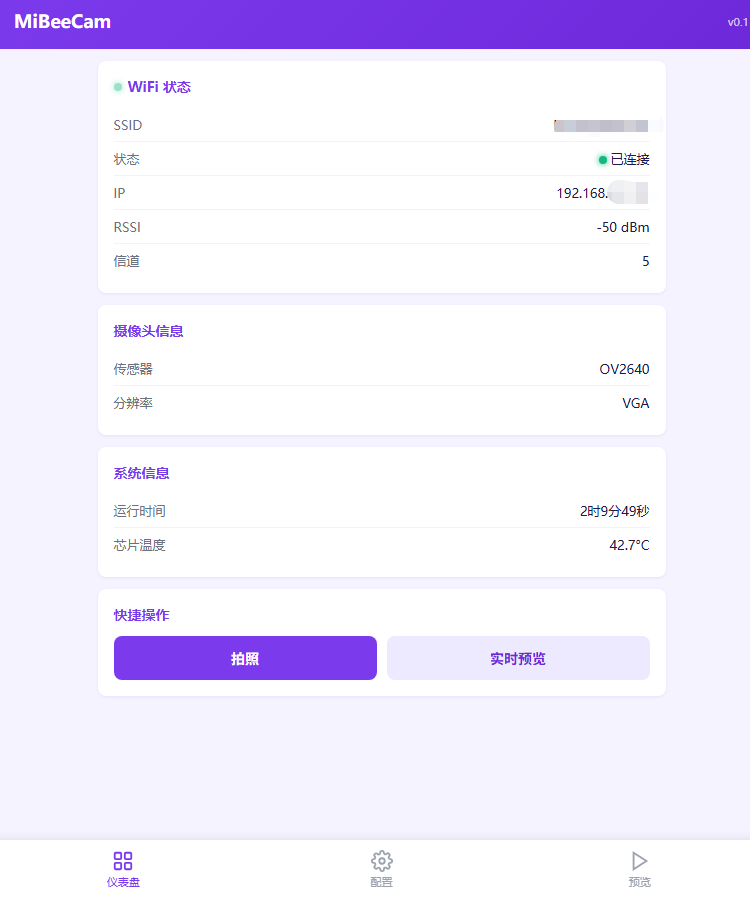

# MiBeeCam - ESP32-S3-A10 智能摄像头
[English](README.md)

## 概述

MiBeeCam 是基于 ESP-IDF v5.4.3 开发的智能摄像头系统，专为 ESP32-S3-A10 开发板设计，配备 OV2640 图像传感器（8225N 模块）。它集成了内置的 Web UI 用于实时监控、MJPEG 视频流、帧差运动检测与自动图像上传功能，以及完整的配置管理系统 — 所有功能都在单个固件中实现。
<p align="center">
    
</p>

## 功能特性

- **摄像头捕获** — OV2640 传感器（8225N），默认 VGA（640×480），支持 SVGA/XGA/UXGA，JPEG 输出
- **WiFi 管理** — STA 模式自动重连，首次配置 AP 热点备用
- **Web 界面** — 仪表盘、实时 MJPEG 预览和配置页面，通过 SPIFFS 提供
<p align="center">
    
</p>
- **MJPEG 流媒体** — 通过 `/stream` 端点实现最高 15 FPS 实时视频
- **运动检测** — 帧差算法，可配置阈值和冷却时间
- **远程上传** — 运动触发时自动 JPEG 上传，3 次重试间隔 2 秒
- **配置管理** — NVS 持久化设置，通过 Web UI 或 REST API 管理
- **健康监控** — 兼容 Prometheus 的 `/metrics` 端点，60 秒间隔
- **状态 LED** — GPIO 10 LED 显示启动/WiFi 连接中/运行中/错误/AP 模式
- **时间同步** — 通过 `pool.ntp.org` NTP，可配置时区

## 项目结构

```
luatos-esp32s3-a10-camera/
├── main/
│   ├── main.c              # 系统入口，14步启动序列
│   ├── camera_driver.c/h   # OV2640 初始化，帧捕获，分辨率控制
│   ├── config_manager.c/h  # NVS 配置存储，v1→v2 自动迁移
│   ├── health_monitor.c/h  # 堆内存/任务监控，Prometheus 指标
│   ├── mjpeg_streamer.c/h  # MJPEG multipart/x-mixed-replace 流
│   ├── motion_detect.c/h   # 帧差检测 + 上传
│   ├── status_led.c/h      # GPIO 10 LED 状态指示器
│   ├── time_sync.c/h       # NTP 时间同步
│   ├── web_server.c/h      # HTTP 服务器（端口 80），REST API，SPIFFS
│   ├── wifi_manager.c/h    # WiFi STA/AP 管理
│   ├── cJSON.c/h           # JSON 解析器
│   └── web_ui/             # SPIFFS 静态文件
│       ├── index.html      # 仪表盘
│       ├── preview.html    # 实时预览
│       └── config.html     # 配置页面
├── .github/workflows/
│   └── build.yml           # CI/CD — 构建 + 标签推送时自动发布
├── CMakeLists.txt
├── sdkconfig.defaults
├── partitions.csv
└── docs/zh-CN/              # 中文文档
```

## 硬件

### 要求

| 项目 | 规格 |
|------|------|
| 开发板 | LuatOS ESP32-S3-A10 |
| 摄像头 | OV2640（8225N 模块） |
| 闪存 | 16 MB |
| PSRAM | 8 MB 八线制（物理存在，**在固件中禁用** — 时序调谐失败） |
| CPU | ESP32-S3 双核 240 MHz |
| 连接 | WiFi 2.4 GHz（802.11 b/g/n） |
| 电源 | 5 V / 2 A 通过 USB-C |

### 摄像头引脚映射

| 引脚 | GPIO | 功能 |
|------|------|------|
| XCLK | 39 | 主时钟 |
| SIOD | 21 | I2C 数据 |
| SIOC | 46 | I2C 时钟 |
| D0–D7 | 34, 47, 48, 33, 35, 37, 38, 40 | 并行数据 |
| VSYNC | 42 | 垂直同步 |
| HREF | 41 | 水平参考 |
| PCLK | 36 | 像素时钟 |
| PWDN | −1 | 已禁用 |
| RESET | −1 | 已禁用 |

> **注意** — 这些引脚来自 `esp32-camera` 组件中的 `CAMERA_MODEL_Air_ESP32S3` 定义，不是来自 LuatOS 文档。

### 分区表

| 分区 | 类型 | 偏移 | 大小 |
|------|------|------|------|
| nvs | data/nvs | 0x9000 | 24 KB |
| phy_init | data/phy | 0xf000 | 4 KB |
| factory | app/factory | 0x10000 | 3.5 MB |
| otadata | data/ota | 0x390000 | 8 KB |
| spiffs | data/spiffs | 0x392000 | ~3.94 MB |

## 软件要求

- **ESP-IDF v5.4.3** — 不要使用 v6.0（此板已知 PSRAM 问题）
- **Python 3.8+**
- **esptool.py**
- **依赖**: `espressif/esp32-camera ^2.0.0`（通过 `idf_component.yml` 解析）

## 快速开始

### 1. 构建

```bash
idf.py set-target esp32s3
idf.py build
```

### 2. 烧录固件

```bash
idf.py -p COMx flash monitor
```

将 `COMx` 替换为您的串口（例如 Windows 上的 `COM3`，Linux 上的 `/dev/ttyUSB0`）。

### 3. 烧录 SPIFFS（Web UI）

Web UI 文件必须在首次设置时单独烧录：

```bash
# 生成 SPIFFS 镜像
python $IDF_PATH/components/spiffs/spiffsgen.py 0x3CE000 main/web_ui build/spiffs.bin

# 烧录到 SPIFFS 分区
python -m esptool --chip esp32s3 -p COMx write_flash 0x392000 build/spiffs.bin
```

### 4. 首次设置（AP 模式）

首次启动时，设备因为没有存储 WiFi 凭证而进入 AP 模式：

1. 连接 WiFi 网络 **MiBeeCam**（密码：`12345678`）
2. 在浏览器中打开 **http://192.168.4.1**
3. 进入配置页面，输入您的 WiFi SSID 和密码
4. 保存 — 设备重启并在 STA 模式下连接

### 5. 恢复出厂设置

按住 **BOOT** 按钮（GPIO 0）**5 秒**。这将清除 NVS 配置并重启进入 AP 模式。

## API 端点

| 方法 | 路径 | 描述 |
|------|------|------|
| GET | `/` | 仪表盘（SPIFFS index.html） |
| GET | `/preview.html` | 实时 MJPEG 预览 |
| GET | `/config.html` | 配置页面 |
| GET | `/stream` | MJPEG 视频流 |
| GET | `/capture` | 单次 JPEG 捕获 + 上传 |
| GET | `/api/status` | JSON 系统状态 |
| GET | `/api/config` | JSON 当前配置 |
| POST | `/api/config` | 更新配置 |
| POST | `/api/reboot` | 重启设备 |
| GET | `/metrics` | 兼容 Prometheus 的指标 |

### 示例

```bash
# 系统状态
curl http://192.168.1.100/api/status

# 更新 WiFi 配置
curl -X POST http://192.168.1.100/api/config \
  -H "Content-Type: application/json" \
  -d '{"wifi_ssid":"MyNetwork","wifi_pass":"MyPassword"}'

# 重启
curl -X POST http://192.168.1.100/api/reboot
```

## 配置

所有设置都存储在 NVS 中，通过 Web UI 或 REST API 管理：

| 参数 | 默认值 | 范围 |
|------|--------|------|
| 分辨率 | VGA (0) | 0=VGA, 1=SVGA, 2=XGA, 3=UXGA |
| FPS | 15 | 1–30 |
| JPEG 质量 | 12 | 1–63（越低越好） |
| 运动阈值 | 5 | 1–255 |
| 运动冷却时间 | 10 秒 | 1–255 |
| 设备名称 | MiBeeCam | 字符串（32 字符） |
| 时区 | CST-8 | POSIX 时区字符串 |

## 启动序列

固件遵循 14 步初始化：

1. NVS 闪存初始化
2. 配置加载（包含 v1→v2 自动迁移）
3. LED 初始化（GPIO 10）
4. SPIFFS 挂载
5. 摄像头初始化（**在 WiFi 之前**，避免 I2C 冲突）
6. WiFi 子系统初始化
7. 健康监控初始化
8. 模式选择（如果配置了 WiFi 则为 STA，否则为 AP）
9. STA：WiFi 连接 / AP：启动热点
10. MJPEG 流媒体初始化（STA 模式）
11. Web 服务器启动（STA 或 AP）
12. NTP 时间同步（STA 模式）
13. 运动检测启动（STA 模式）
14. BOOT 按钮监控（5 秒按住 = 恢复出厂设置）

## 故障排除

| 问题 | 原因 | 解决方案 |
|------|------|----------|
| 摄像头初始化失败 | 引脚映射错误 | 验证 8225N 模块引脚与 `camera_driver.c` 匹配 |
| 启动循环 | PSRAM 时序失败 | PSRAM 必须在 `sdkconfig` 中保持禁用 |
| WiFi 无法连接 | 5 GHz 网络 | ESP32-S3 仅支持 2.4 GHz |
| /stream 返回 404 | 通配符 URI 处理器拦截 | 在 `/*` 处理器之前注册 `/stream` |
| SPIFFS 挂载失败 | 分区不匹配 | 确保 SPIFFS 偏移量（0x392000）与 `partitions.csv` 匹配 |
| Web UI 显示乱码 | HTML 中的 Unicode 转义 | 将 `\uXXXX` 替换为实际的 UTF-8 字符 |
| 误运动触发 | 阈值太低 | 在 Web UI 配置中提高运动阈值 |

详细信息请参阅 [docs/zh-CN/troubleshooting.md](docs/zh-CN/troubleshooting.md)。

## 许可证

MIT License — Mi&Bee Studio