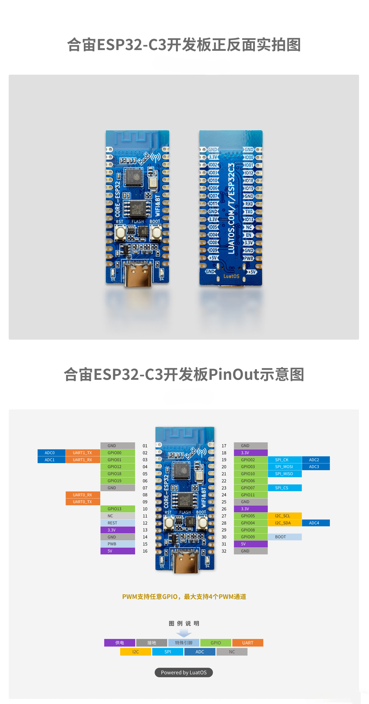

# Hardware Specification - MiBeeCam ESP32-S3-A10

This document provides detailed hardware specifications and configuration information for the MiBeeCam ESP32-S3-A10 smart camera system.

## System Overview

The MiBeeCam system is built around the ESP32-S3 microcontroller with OV2640 camera sensor, optimized for compact video surveillance and IoT monitoring applications.

    

## Microcontroller Specifications

### ESP32-S3 Core
- **Architecture**: Dual-core Tensilica Xtensa LX7
- **Clock Speed**: 240 MHz dual-core operation
- **Memory**: 
  - 512KB SRAM (384KB IRAM, 128KB DRAM)
  - 8MB Octal PSRAM (physically present but disabled in firmware)
  - 16MB Flash memory
- **Features**:
  - Wi-Fi 4 (802.11 b/g/n) 2.4GHz only
  - Bluetooth 5.0 LE
  - 34 GPIO pins
  - 12 ADC channels
  - 8 PWM channels
  - 2 DAC channels

### Flash Memory
- **Capacity**: 16MB
- **Type**: QSPI Serial Flash
- **Read Speed**: Up to 80MHz
- **Page Size**: 256 bytes
- **Sector Size**: 4KB

### Memory Partition Table

| Name | Type | SubType | Offset | Size | Description |
|------|------|---------|--------|------|-------------|
| nvs | data | nvs | 0x9000 | 24KB (0x6000) | Non-Volatile Storage |
| phy_init | data | phy | 0xf000 | 4KB (0x1000) | PHY initialization data |
| factory | app | factory | 0x10000 | 3.5MB (0x380000) | Main application |
| otadata | data | ota | 0x390000 | 8KB (0x2000) | OTA data storage |
| spiffs | data | spiffs | 0x392000 | ~3.94MB (0x3CE000) | File system |

## Camera Module

### OV2640 Sensor Specifications
- **Resolution**: 2 megapixels (1600x1200)
- **Supported Resolutions**: VGA (640x480), SVGA (800x600), XGA (1024x768), UXGA (1600x1200)
- **Frame Rates**: 1-30 FPS (resolution dependent)
- **Color Format**: YUV 4:2:2
- **Output**: JPEG compression
- **Interface**: 8-bit parallel DVP (Digital Video Port)

### Camera Pin Mapping

| Signal | Pin Number | Function | Description |
|--------|------------|----------|-------------|
| XCLK | 39 | Clock | Camera master clock (LEDC method) |
| SIOD | 21 | I2C Data | Camera I2C data line |
| SIOC | 46 | I2C Clock | Camera I2C clock line |
| D0 | 34 | Data Bit 0 | Parallel data bus |
| D1 | 47 | Data Bit 1 | Parallel data bus |
| D2 | 48 | Data Bit 2 | Parallel data bus |
| D3 | 33 | Data Bit 3 | Parallel data bus |
| D4 | 35 | Data Bit 4 | Parallel data bus |
| D5 | 37 | Data Bit 5 | Parallel data bus |
| D6 | 38 | Data Bit 6 | Parallel data bus |
| D7 | 40 | Data Bit 7 | Parallel data bus |
| VSYNC | 42 | Vertical Sync | Frame synchronization |
| HREF | 41 | Horizontal Ref | Line synchronization |
| PCLK | 36 | Pixel Clock | Pixel data clock |
| PWDN | -1 | Power Down | Power control (disabled) |
| RESET | -1 | Reset | Reset control (disabled |

### Camera Configuration
- **Default Resolution**: VGA (640x480)
- **Default Frame Rate**: 15 FPS
- **Default JPEG Quality**: 12 (1-63, lower = better)
- **Frame Buffer**: CAMERA_FB_IN_DRAM (single buffer)
- **Camera Model**: CAMERA_MODEL_Air_ESP32S3

## Interface Connections

### GPIO Usage

| GPIO Pin | Function | Description |
|----------|----------|-------------|
| 0 | BOOT Button | Factory reset when held for 5 seconds |
| 10 | Status LED | System status indicator |
| 15 | XCLK | Camera clock (LEDC) |
| 21 | SIOD | Camera I2C data |
| 33 | D3 | Camera data bus |
| 34 | D0 | Camera data bus |
| 35 | D4 | Camera data bus |
| 36 | PCLK | Camera pixel clock |
| 37 | D5 | Camera data bus |
| 38 | D6 | Camera data bus |
| 39 | XCLK | Camera clock (LEDC alternate) |
| 40 | D7 | Camera data bus |
| 41 | HREF | Camera horizontal reference |
| 42 | VSYNC | Camera vertical sync |
| 46 | SIOC | Camera I2C clock |
| 47 | D1 | Camera data bus |
| 48 | D2 | Camera data bus |

### Status LED Patterns

| Pattern | Description | System State |
|---------|-------------|--------------|
| LED_STARTING | Boot up | System initialization |
| LED_WIFI_CONNECTING | WiFi connecting | Establishing network connection |
| LED_RUNNING | System normal | All services operational |
| LED_ERROR | Error state | System error condition |
| LED_AP_MODE | AP hotspot active | Fallback to AP mode |

### BOOT Button Functionality
- **Short press**: System reboot
- **Long press (5+ seconds)**: Factory reset (NVS configuration cleared)

## Power Requirements

### Operating Voltage
- **Nominal**: 3.3V DC
- **Range**: 3.0V - 3.6V
- **Current Draw**:
  - **Idle**: ~50mA
  - **Camera active**: ~120mA
  - **WiFi transmitting**: ~180mA
  - **Peak**: ~250mA during capture

### Power Considerations
- Use stable 3.3V power supply with at least 300mA current capability
- Camera operation increases power consumption significantly
- Consider power filtering for stable operation

## Physical Specifications

### Form Factor
- **Dimensions**: Compatible with ESP32-S3 development boards
- **Camera Module**: OV2640 with 8225N GC2053 interface
- **Operating Temperature**: -10°C to +60°C
- **Storage Temperature**: -20°C to +85°C

### Environmental Considerations
- Designed for indoor use
- Avoid high humidity environments
- Ensure proper ventilation for heat dissipation

## Signal Characteristics

### Camera Timing
- **XCLK Frequency**: 10 MHz (generated via LEDC)
- **PCLK Frequency**: 10 MHz
- **Frame Buffer Timing**: Single buffer design, captures one frame at a time

### WiFi Characteristics
- **Frequency**: 2.4GHz ISM band only
- **Channels**: 1-14 (regional dependent)
- **Standard**: IEEE 802.11 b/g/n
- **Security**: WPA2-PSK, WPA3-Personal (if supported)

## Performance Limitations

### Memory Constraints
- **PSRAM Disabled**: Due to timing tuning issues causing boot loops
- **Frame Buffer Limitation**: Single DRAM buffer restricts maximum resolution
- **JPEG Quality**: Trade-off between file size and quality

### Camera Resolution Limits
- **VGA (640x480)**: ~60KB per frame, supports 15 FPS
- **SVGA (800x600)**: ~480KB per frame, may exceed memory limits
- **Higher Resolutions**: Not recommended due to memory constraints

### Network Constraints
- **Single-Band**: 2.4GHz only, no 5GHz support
- **Client Limit**: Maximum 2 concurrent MJPEG stream clients
- **Frame Rate**: Limited by WiFi bandwidth and server load

## Configuration Notes

### Critical Configuration Parameters
- **Camera Model**: Must be CAMERA_MODEL_Air_ESP32S3
- **XCLK Method**: LEDC required, not GPIO matrix
- **PSRAM**: Disabled due to ESP-IDF compatibility issues
- **Partition Table**: Must match exact offsets for SPIFFS

### Hardware Compatibility
- ESP-IDF v5.4.3 required (v6.0 has PSRAM bugs)
- OV2640 modules with 8225N/GC2053 interface
- Standard ESP32-S3 development boards

## Testing and Validation

### Hardware Verification
- **Power Supply**: Measure 3.3V ±5% at all components
- **Clock Signals**: Verify XCLK and PCLK timing with oscilloscope
- **Data Bus**: Check camera data signals for noise and integrity
- **WiFi Signal**: Ensure antenna connection and RF shielding

### Functionality Tests
- **Camera Capture**: Verify JPEG image generation
- **WiFi Connection**: Test STA and AP modes
- **Web Interface**: Access HTTP endpoints and streaming
- **LED Status**: Verify correct boot and operating patterns
- **Motion Detection**: Test upload functionality